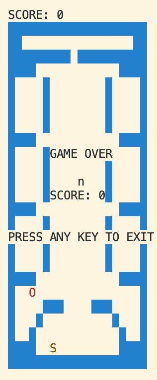

# Snake Game with Bots Enabled

---

## Design Overview:

---

### BOT <- Simple Bot

This bot is designed so that when the `BOT` macro (in `snake.c`) is defined, it will generate random directions of UP, DOWN, LEFT and RIGHT using `set_seed()` function and `rand()` function. This way, when the program runs, the bot will automatically put in inputs for the snake to move in the grid instead of having user inputs.

### Wrap Around

This utilizes how the cells are stored consecutively and uses index manipulation to realize the wrap around functionality. When `WRAP`(`game.c`) is defined, player will be able to wrap around the border if there is no WALL at this location.

---

## Responsible Computing:

---

### Who founded the Consortium? Who is represented among the current members, and how might that affect decisions being made for Unicode?

- According to Unicode.org, the Consortium started by three engineers - Joe Becker from Xerox, Lee Collins and Mark Davis from Apple.
- Currently, there are 13 members that works as directors on board (2020-2029). Of the 13 members, majority of them also works in tech companies - including Netflix (Tim Brandall), Microsoft (Ayman Aldahleh), Adobe (Brent Getlin), etc.
- Such composition of the board members could help with both the iteration of Unicode and also its business-awareness. Since Netflix, Microsoft, Apple and other tech companies provides their services across countries, the current members from, say Apple, could help update Unicode so that it supports the newly released emoji. This might enable Unicode to have fast iteration of standards so that they could align with the market. The market driven strategy could also help with Unicode unifying some not-yet supported languages and scripts so that more users could benefit from it. Vice versa, tech companies also adopts Unicode standard which makes Unicode unifiable.

### Find a language that is not yet in Unicode, has only recently been supported (e.g., in the last 10 years), or is/was missing important characters. What is/was missing, and how does this affect the users of the language?

- While popular languages are supported in Unicode, some ancient langauge or newly created scripts - like bitcoin symbols or new emoji - have not been unified yet. Unicode's board have outlined languages and scripts that they will be working on each year and as new languages are supported, it definitely makes convenient for the user's of these languages.
- Miao which is a local langauge of Miao Zu was supported in March 2019. While CJK has a lot of commonalities, Miao scripts are loosely based on latin alphabets. Users who speak A-Hmao which is one of Miao languages spoken in Southeast Asia could benefit from such unification.

Interesting finding:

- "XiangQi" (Chinese Chess) was supported in Unicode in 2018. I liked playing XiangQi as a kid so it is fun knowing that XiangQi characters are now supported in Unicode. I also haven't looked into XiangQi's history and just found out that there are many interpretations of when XiangQi was originated but a popular belief is that it started becoming popular in Warring States Period (770 BC–221 BC).

### Here are some cool chess characters:

### For this question, you will need to work with a classmate! Make sure to coordinate so that you outline opposing positions for Part A (e.g. if you outline the ‘for’ position, your partner defends the ‘against’ position). Then, come together and discuss Part B!

### Individual answer to Part A

While some might argue that Han Unification undermines the cultural significance and difference of glyphs between the languages of different regions and countries, CJK unification is, admittedly, an efficient way of storing characters. Many words, like "courage" is written as "勇気" in Japanese as oppose to "勇气" in simiplified Chinese, have common language roots. Since Chinese (Simplified & Traditional), Japanese and Korean do share a lot of commonalities in their words compositions and the compatabilities made Han Unification possible, Han Unification seems to be a reasonable approach as it saves bytes/space in storing these words. Since Unicode's primary purpose is to have a unified standard to represent characters, CKJ seems to align with its purpose.

reference: https://unicode.org/faq/han_cjk.html.

---

### Arnold Lab floor plan

"B15x15|W3E3W2E2W5|E2W1E7W1E4|E2W1E7W1E4|E2W1E7W1E4|E10W2E3|W3E12|E2W1E1S1E6W4|E2W1E3W2E4W1E2|E2W1E3W2E7|E14W1|W3E12|W5E5W1E2W1E1|W2E6W7|W2E2W1E10|W2E1W12"

This is a floor plan of my shared office space in Arnold which is next to science library.

---

### Sceince Library

"B25x20|W20|W2E16W2|W9E1W10|W4E12W4|W1E4W1E8W1E4W1|W1E4W1E8W1E4W1|W1E4W1E8W1E4W1|W1E4W1E8W1E4W1|W4E12W4|W1E4W1E8W1E4W1|W1E4W1E8W1E4W1|W1E4W1E8W1E4W1|W1E4W1E8W1E4W1|W4E12W4|W1E4W1E8W1E4W1|W1E4W1E8W1E4W1|W1E4W1E8W1E4W1|W1E4W1E8W1E4W1|W4E12W4|W1E18W1|W1E4W3E4W3E4W1|W1E3W1E10W1E3W1|W1E2W1E5S1E6W1E2W1|W4E12W4|W20"
This will create the Brown Science Library map as one game level.

---
